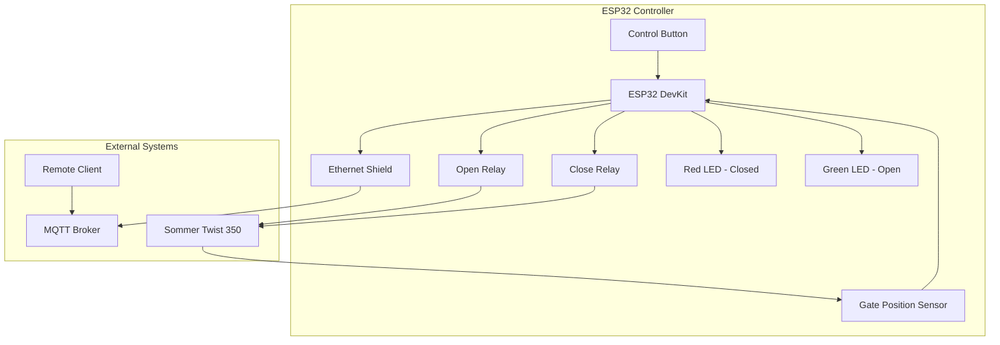
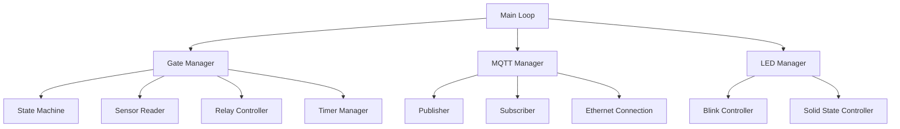
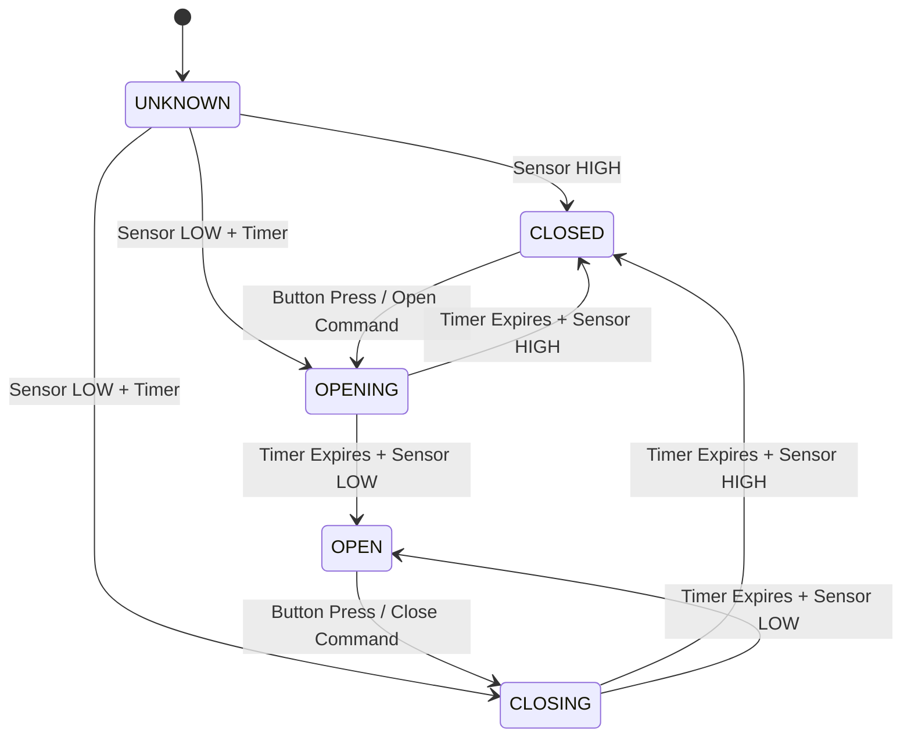

# Design Document

## Overview

The ESP32 Swing Gate Controller is a comprehensive embedded system designed to control and monitor a Sommer Twist 350 swing gate. The system integrates local control via physical button, remote control via MQTT over Ethernet, real-time status monitoring, and visual feedback. The design emphasizes reliability, safety, and ease of installation.

## Architecture

### System Architecture



### Software Architecture



## Components and Interfaces

### Hardware Components

#### ESP32 Development Board
- **Model**: ESP32 DevKit v1 or similar
- **Purpose**: Main microcontroller
- **Interfaces**: GPIO, UART, SPI
- **Power**: 5V via USB or external supply

#### Ethernet Shield
- **Model**: W5500 Ethernet Shield (e.g., WIZnet W5500 Ethernet Shield)
- **Purpose**: Network connectivity for MQTT communication
- **Interface**: SPI connection to ESP32 (MOSI: GPIO23, MISO: GPIO19, SCK: GPIO18, CS: GPIO5)
- **Configuration**: DHCP or static IP
- **Library**: Standard Ethernet library for ESP32

#### Relay Module
- **Type**: 2-channel 5V relay module
- **Purpose**: Control gate motor open/close signals
- **Isolation**: Optocoupled for safety
- **Contact Rating**: 10A @ 250VAC

#### LEDs and Indicators
- **Red LED**: Gate closed status (GPIO 12)
- **Green LED**: Gate open status (GPIO 14)
- **Current Limiting**: 220Ω resistors

#### Input Components
- **Control Button**: Momentary push button (GPIO 13)
- **Gate Sensor**: Position sensor from Sommer system (GPIO 22)
- **Pull-up**: Internal pull-up resistors enabled

### Software Components

#### Gate Class
```cpp
class Gate {
private:
    enum GateState {
        GATE_UNKNOWN,
        GATE_CLOSED,
        GATE_OPENING,
        GATE_OPEN,
        GATE_CLOSING
    };
    
    GateState currentState;
    Timer<> stateTimer;
    Timer<> relayTimer;
    bool sensorState;
    unsigned long lastStateChange;
    
public:
    void initialize();
    void update();
    void toggle();
    void openGate();
    void closeGate();
    GateState getState();
    bool isMoving();
};
```

#### MQTT Manager Class
```cpp
class MQTTManager {
private:
    EthernetClient ethClient;
    PubSubClient mqttClient;
    String clientId;
    String statusTopic;
    String commandTopic;
    unsigned long lastPublish;
    const unsigned long publishInterval = 10000; // 10 seconds as per Requirement 7
    
public:
    void initialize();
    void connect();
    void publishStatus(String status);
    void handleCommands();
    void update();
    bool isConnected();
    void onMessageReceived(char* topic, byte* payload, unsigned int length);
};
```

#### LED Manager Class
```cpp
class LEDManager {
private:
    Timer<> blinkTimer;
    bool blinkState;
    
public:
    void initialize();
    void setStatus(GateState state);
    void update();
    void solidRed();
    void solidGreen();
    void blinkRed();
    void blinkGreen();
    void allOff();
};
```

## Data Models

### Gate State Machine



### MQTT Message Format

#### Status Messages (Published)
```json
{
    "device_id": "esp32_gate_001",
    "timestamp": 1640995200,
    "state": "CLOSED|OPEN|OPENING|CLOSING|UNKNOWN",
    "sensor_raw": true|false,
    "uptime": 3600
}
```

#### Command Messages (Subscribed)
Simple string commands as per Requirement 7:
- **"OPEN"**: Command to open the gate
- **"CLOSE"**: Command to close the gate  
- **"TOGGLE"**: Command to toggle gate state

Alternative JSON format (optional):
```json
{
    "command": "OPEN|CLOSE|TOGGLE",
    "timestamp": 1640995200,
    "source": "remote_app"
}
```

### Configuration Structure
```cpp
struct Config {
    // MQTT Settings (Requirement 7)
    char mqttBroker[64] = "broker.hivemq.com";
    int mqttPort = 1883;
    char clientId[32]; // Random client ID generated at startup
    char statusTopic[64] = "gate/status";
    char commandTopic[64] = "gate/command";
    
    // Timing Settings
    unsigned long gateOperationTime = 20000; // 20 seconds (Requirement 2)
    unsigned long relayPulseTime = 500;      // 500ms (Requirement 1)
    unsigned long publishInterval = 10000;   // 10 seconds (Requirement 7)
    unsigned long blinkInterval = 500;       // 500ms (Requirement 3)
    unsigned long debounceTime = 50;         // 50ms button debounce
    
    // GPIO Pins
    int buttonPin = 13;
    int sensorPin = 22;
    int redLedPin = 12;
    int greenLedPin = 14;
    int openRelayPin = 2;
    int closeRelayPin = 0;
    
    // Ethernet SPI Pins
    int ethernetCSPin = 5;
    int ethernetMOSIPin = 23;
    int ethernetMISOPin = 19;
    int ethernetSCKPin = 18;
};
```

## Error Handling

### Network Connectivity
- **MQTT Connection Loss**: Retry connection every 30 seconds
- **Ethernet Failure**: Continue local operation, log errors
- **Publish Failures**: Queue messages for retry (max 5 messages)

### Hardware Failures
- **Sensor Malfunction**: Default to UNKNOWN state, disable automatic operations
- **Relay Failure**: Log error, prevent further relay operations
- **Button Debouncing**: 50ms debounce period to prevent false triggers

### State Management
- **Invalid State Transitions**: Log error, reset to UNKNOWN state
- **Timer Overruns**: Force state evaluation after 25 seconds (5s buffer)
- **Conflicting Commands**: Ignore new commands while gate is moving

### Safety Mechanisms
- **Relay Timeout**: Automatic relay deactivation after 500ms
- **State Validation**: Cross-check sensor readings with expected states
- **Watchdog Timer**: System reset if main loop hangs for >5 seconds

## Testing Strategy

### Unit Testing
- **Gate State Machine**: Test all state transitions and edge cases
- **MQTT Communication**: Mock broker for message publishing/subscribing
- **Timer Management**: Verify timing accuracy and timeout handling
- **Sensor Reading**: Test debouncing and state change detection

### Integration Testing
- **Hardware-in-Loop**: Test with actual relays and sensors
- **Network Testing**: Test MQTT connectivity with real broker
- **End-to-End**: Complete gate operation cycles
- **Error Scenarios**: Network failures, sensor disconnections

### Simulation Testing (Wokwi)
- **Virtual Hardware**: Complete system simulation (Requirement 6)
- **Button Interactions**: Simulated button presses
- **Sensor Simulation**: Virtual gate position feedback
- **Serial Monitoring**: Debug output verification at 115200 baud
- **Library Compatibility**: PubSubClient and arduino-timer libraries supported

## Library Dependencies and Compatibility

### Required Libraries (from libraries.txt)
- **PubSubClient**: MQTT client library for ESP32 (Requirement 7)
  - Version: Latest stable
  - Purpose: MQTT communication with broker.hivemq.com
  - Features: Publish/Subscribe, automatic reconnection
  
- **arduino-timer**: Timer management library
  - Version: Latest stable  
  - Purpose: Non-blocking timing for gate operations and LED blinking
  - Features: Multiple concurrent timers, callback support

### Additional ESP32 Libraries
- **Ethernet**: Built-in ESP32 Ethernet support for W5500
- **SPI**: SPI communication for Ethernet shield
- **WiFi**: Not used, but available for future expansion

### Library Configuration
```cpp
// PubSubClient configuration
#define MQTT_MAX_PACKET_SIZE 256
#define MQTT_KEEPALIVE 15

// Timer configuration  
#define MAX_TIMERS 5  // Gate timer, relay timers, blink timer, MQTT timer
```

### Performance Testing
- **Response Time**: Button press to relay activation (<100ms)
- **Network Latency**: MQTT command to action (<500ms)
- **Memory Usage**: Monitor heap usage during operation
- **Timing Accuracy**: Verify 20-second gate operation timing
- **Serial Communication**: Verify diagnostic output at 115200 baud (Requirement 4)

## Serial Communication and Diagnostics (Requirement 4)

### Serial Output Configuration
- **Baud Rate**: 115200 (as specified in Requirement 4)
- **Format**: 8N1 (8 data bits, no parity, 1 stop bit)
- **Buffer Size**: 256 bytes for message queuing

### Diagnostic Message Format
```cpp
// Initialization messages
"[INIT] ESP32 Gate Controller v1.0 starting..."
"[INIT] GPIO pins configured successfully"
"[INIT] MQTT client initialized"

// State change logging
"[STATE] Gate state changed: CLOSED -> OPENING"
"[STATE] Gate state changed: OPENING -> OPEN"

// Button event logging
"[BUTTON] Button pressed - Gate command: OPEN"
"[BUTTON] Button released"

// Relay operation logging
"[RELAY] Open relay activated"
"[RELAY] Open relay deactivated after 500ms"
"[RELAY] Close relay activated"
"[RELAY] Close relay deactivated after 500ms"

// MQTT communication logging
"[MQTT] Connected to broker: broker.hivemq.com"
"[MQTT] Status published: GATE_OPEN"
"[MQTT] Command received: CLOSE"

// Error logging
"[ERROR] MQTT connection failed, retrying..."
"[ERROR] Sensor reading invalid, state set to UNKNOWN"
```

### Debug Output Management
- **Log Levels**: INFO, WARNING, ERROR
- **Timestamp**: Milliseconds since boot for timing analysis
- **Memory Monitoring**: Periodic heap usage reports
- **Performance Metrics**: Loop execution time monitoring

## Integration with Sommer Twist 350

### Wiring Diagram and Connection Manual

Based on Sommer Twist 350 manual (pages 31-34), the following connections are required:

#### Sommer Twist 350 Terminal Block Layout
```
Terminal Block X1:
1-2:   24V AC Power Input (Main Power)
3-4:   Not Used
5-6:   Not Used
7-8:   OPEN Command Input (Dry Contact)
9-10:  CLOSE Command Input (Dry Contact)
11-12: Not Used
13-14: Not Used
15-16: Gate Position Sensor Output (24V/0V)
17-18: Common for Command Inputs
```

#### ESP32 Controller to Sommer Twist 350 Wiring

| ESP32 Connection | Wire Color | Sommer Terminal | Function |
|------------------|------------|-----------------|----------|
| Relay 1 NO Contact | Red | Terminal 7 | Open Command (+) |
| Relay 1 COM Contact | Black | Terminal 17 | Command Common |
| Relay 2 NO Contact | Blue | Terminal 9 | Close Command (+) |
| Relay 2 COM Contact | Black | Terminal 17 | Command Common |
| GPIO 22 (via voltage divider) | Yellow | Terminal 15 | Position Sensor |
| ESP32 GND | Green | Terminal 16 | Sensor Common |

#### Voltage Divider for Position Sensor
Since Sommer outputs 24V and ESP32 expects 3.3V maximum:
- **R1**: 22kΩ (24V side)
- **R2**: 3.3kΩ (ESP32 side)
- **Zener Diode**: 3.3V for additional protection

#### Installation Steps
1. **Power Down**: Ensure Sommer Twist 350 is powered off
2. **Access Terminal Block**: Remove cover to access X1 terminal block
3. **Connect Relay Outputs**: Wire ESP32 relay contacts to terminals 7-8 and 9-10
4. **Connect Common**: Wire both relay commons to terminal 17
5. **Connect Position Sensor**: Wire voltage divider output to GPIO 22, ground to terminal 16
6. **Verify Connections**: Double-check all wiring before powering up
7. **Test Operation**: Power up and test gate operation with button

#### Safety Considerations
- **Isolation**: Relay contacts provide galvanic isolation between 24V and 3.3V systems
- **Voltage Protection**: Voltage divider and Zener diode protect ESP32 from overvoltage
- **Fusing**: Install 2A fuse on ESP32 power input for protection
- **Grounding**: Ensure proper grounding between systems

#### Signal Specifications
- **Command Inputs**: Dry contact closure, 24V tolerant, minimum 100ms pulse
- **Position Sensor**: 24V output when gate closed, 0V when open/moving
- **Current Draw**: <50mA per relay contact
- **Response Time**: <100ms from command to relay activation