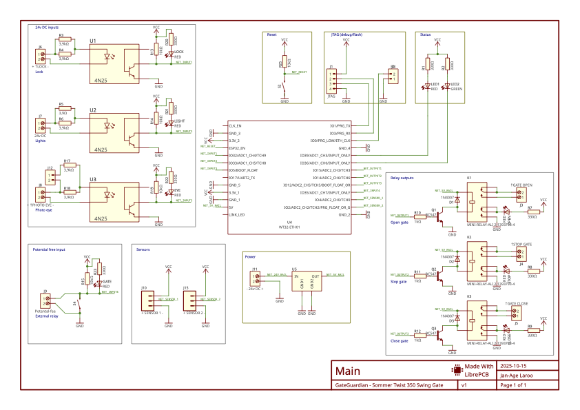

# Gate Guardian


  

**Automating the Sommer Twist 350 Swing Gate with ESP32 and MQTT**

This repository contains the design and code for Gate Guardian, an ESP32 swing gate controller designed to operate and monitor a Sommer Twist 350 swing gate. The system integrates remote control via MQTT over Ethernet, real-time status monitoring, and visual feedback. The design emphasizes reliability, safety, and ease of installation.

## Schematics and PCB

Used LibrePCB to design the schematics and PCB.




Gerber files for the PCB can be found [here](librepcb/output/v1/gerber).

# Input/Output

| Pin | Direction | Function | Note |
|----|----------|----------|------|
| GPIO 12 | Output | Gate Close Relay | Pulse to close the gate |
| GPIO 14 | Output | Gate Stop Relay | Pulse to stop the gate |
| GPIO 15 | Output | Gate Open Relay | Pulse to open the gate |
| GPIO 17 | Output | Red LED | Blinking during closing, solid during opening |
| GPIO 5 | Output | Green LED | Blinking during opening, solid during closing |
| GPIO 33 | Input | Gate Lights | Blinking warning light when opening or cloing |
| GPIO 32 | Input | Gate Lock | Enabled when gate is closed |
| GPIO 35 | Input | External Relay | Triggered when gate is closed |
| GPIO 36 | Input | Photo eye | When someone/omething goes through the gate |
| GPIO 4 | Input | Sensor 1 | Optional sensor (not used) |
| GPIO 2 | Input | Sensor 2 | Optional sensor (not used) |

## Code

The firmware is built on the Arduino framework using PlatformIO and implements a robust gate control system with the following key features:

- **MQTT Integration**: Remote control and status monitoring via MQTT over Ethernet (W5500)
- **Visual Feedback**: Dual LED system (red/green) indicating gate state with blinking patterns during movement
- **Position Sensing**: Real-time gate position detection using magnetic sensors
- **Safety Features**: Relay pulse timing, state machine logic, and operation timeouts
- **Diagnostics**: Serial output at 115200 baud for debugging and monitoring


### Platform IO Setup

```
pyenv local 3.13
python -m venv .venv
source .venv/bin/activate
pip install -r requirements.txt
```

### Build

```
pio run
```

### Upload

```
pio run --target upload -v
```
