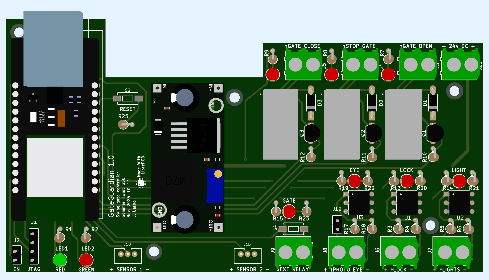

# Gate Guardian

  

  

**Automating the Sommer Twist 350 Swing Gate with ESP32 and MQTT**

This repository contains the design and code for Gate Guardian, an ESP32 swing gate controller designed to operate and monitor a Sommer Twist 350 swing gate. The system integrates remote control via MQTT over Ethernet, real-time status monitoring, and visual feedback. The design emphasizes reliability, safety, and ease of installation.

## Schematics and PCB

Used LibrePCB to design the schematics and PCB.




Gerber files for the PCB can be found [here](librepcb/output/v1/gerber).

## Code

The ESP32 code can be found in the [here](src).

### Platform IO Setup

```
pyenv local 3.13
python -m venv .venv
source .venv/bin/activate
pip install -r requirements.txt
```
